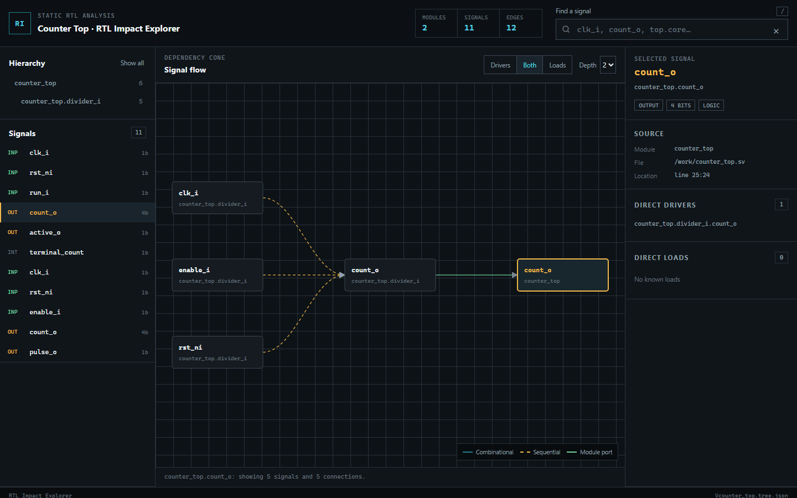

# RTL Impact Explorer

RTL Impact Explorer is a static-analysis tool for tracing how signals influence each other across an elaborated SystemVerilog design.

Click a signal to see its direct drivers and loads, follow a bounded dependency cone across module boundaries, and jump back to the source location that created each connection. The output is a self-contained browser report, so it can be shared or opened locally without running a server.



## Why I built it

When I am reading unfamiliar RTL, the slow part is rarely finding one signal. The slow part is answering the next questions: where did it come from, what else can it affect, and does that path cross a module boundary?

I built RTL Impact Explorer to make that investigation visual. It is inspired by [Dara-O's VeriTrace](https://github.com/Dara-O/veritrace), but it is an independent implementation built around Verilator's current JSON output. VeriTrace used the older XML output; Verilator 5.052 removed those deprecated XML flags, so this project targets the supported [`--json-only`](https://verilator.org/guide/latest/exe_verilator.html) interface instead.

## What it does

- Reads an elaborated Verilator 5 JSON design.
- Reconstructs module instances, signals, widths, directions, and source locations.
- Connects assignments, sequential processes, and parent/child module ports.
- Traces bounded fan-in and fan-out cones without repeating nodes.
- Filters signals by name or module hierarchy.
- Exports a responsive, keyboard-accessible report with no CDN or runtime dependency.
- Runs through a native Verilator installation or an automatic Docker fallback.

## Quick start

You need Python 3.11 or newer and either Docker or a native Verilator installation.

```powershell
git clone https://github.com/JoelObinnaEze/rtl-impact-explorer.git
cd rtl-impact-explorer
py -m pip install -e .

rtl-impact analyze examples\counter_top.sv `
  --top counter_top `
  --output report `
  --engine auto
```

Open `report/index.html` when the command finishes. The generated report also works directly over `file://`.

If you already have Verilator JSON output:

```powershell
rtl-impact analyze-json obj_dir\Vcounter_top.tree.json `
  --meta obj_dir\Vcounter_top.tree.meta.json `
  --output report
```

## How it works

```text
SystemVerilog source
        │
        ▼
Verilator --json-only
        │
        ▼
JSON compatibility layer
        │
        ├── module instances and signals
        ├── source locations and data types
        ├── process read/write dependencies
        └── parent/child port connections
        │
        ▼
Stable project model
        │
        ▼
Versioned report payload + local browser UI
```

The compatibility layer keeps Verilator-specific details out of the graph and report code. That gives the project one place to adapt if the upstream AST changes.

Process edges are intentionally conservative. If a process reads signal `A` and writes signal `B`, the report records `A → B`. This captures useful control dependencies such as enables and resets, but it is not a bit-accurate proof of influence.

## A short demo path

The included example is a two-module counter design.

1. Search for `active_o`.
2. Select **Drivers** and set the depth to **3**.
3. Follow the path through `terminal_count`, `pulse_o`, and `count_o`.
4. Select `run_i` and switch to **Loads** to inspect downstream impact.
5. Click graph nodes or the direct-connection lists to move through the design.

## Engineering choices

- **Standard-library Python:** no runtime packages are required.
- **Project-owned data model:** the frontend never consumes the Verilator AST directly.
- **Deterministic output:** signals, edges, and graph traversal use stable ordering.
- **Safe command execution:** Verilator and Docker are invoked as argument lists, not through a shell.
- **Fetch-free frontend:** the generated report has no network calls and renders untrusted design text with DOM text nodes.
- **Explicit limits:** the current graph is signal/process-level rather than pretending to be a formal or bit-precise analysis.

## Development

Run the test suite:

```powershell
$env:PYTHONPATH = "src"
py -m unittest discover -s tests -v
```

Check the browser JavaScript:

```powershell
node --check src\rtl_impact_explorer\web\app.js
node --check src\rtl_impact_explorer\web\graph-view.js
```

Build the installable wheel:

```powershell
py -m pip wheel . --no-deps --wheel-dir dist
```

The test fixture was generated from the included SystemVerilog example using the official Verilator Docker image. The full CLI path has also been exercised against that image.

## Current limits

- Verilator is required for source elaboration; this is not a standalone SystemVerilog parser.
- Dependencies are signal-level and process-level, not bit-select precise.
- Functions, tasks, interfaces, arrays, and less common data types need broader fixture coverage.
- Large designs will eventually need graph virtualization.
- Git change-impact comparison and clock/reset-domain analysis are planned follow-on work.

The detailed behavior contract is in [SPEC.md](SPEC.md), and the implementation slices are recorded in [tasks/plan.md](tasks/plan.md).

## Attribution

RTL Impact Explorer is inspired by [Dara-O/veritrace](https://github.com/Dara-O/veritrace), Copyright © 2023 Isaac Ogunmola, which is distributed under the MIT License. No VeriTrace source code is included here.

Verilator is a separate open-source project maintained under its own licenses. See the [Verilator documentation](https://verilator.org/guide/latest/) for details.
